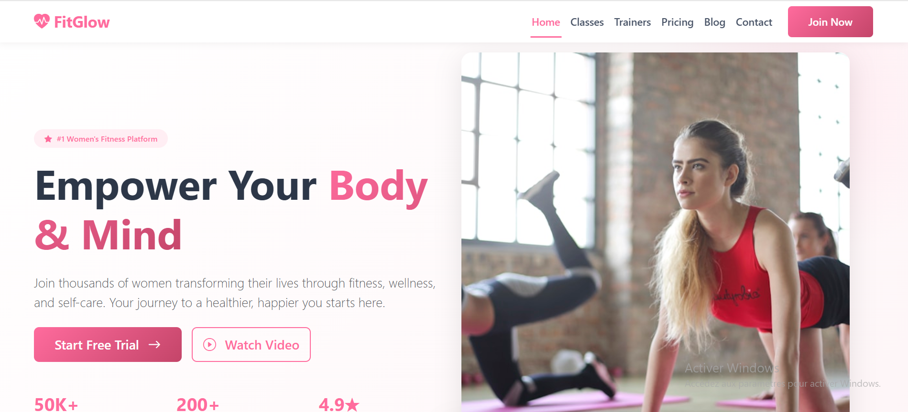

FitGlow - Bootstrap 5 Fitness Website

Modern fitness platform for women built with Bootstrap 5.

## 📦 What's Inside

**6 Pages:**

- Home
- Classes
- Trainers
- Pricing
- Blog
- Contact

**Bootstrap Components:**

- Navbar, Cards, Modals, Carousel, Forms, Offcanvas, Badges, Buttons

**Features:**

- Pink theme
- Fully responsive
- Form validation
- Interactive filters
- Smooth animations

## 🚀 Quick Start

1. Extract the ZIP
2. Open `index.html` in browser
3. Done!

## 📁 Structure

```
fitglow-bootstrap/
├── index.html
├── css/style.css
├── js/script.js
└── pages/
    ├── classes.html
    ├── trainers.html
    ├── pricing.html
    ├── blog.html
    └── contact.html
```

## 🎨 Colors

- Primary: `#ff6b9d`
- Dark: `#c44569`

## 🌐 Deploy

Voici mon projet Bootstrap déployé en ligne pour démo :

🔗 [Voir la démo](https://mekid-asmaa-hayat.github.io/Projet-Bootstrap/)


## 💻 Technologies

- Bootstrap 5.3.2
- HTML5
- CSS3
- JavaScript

## 📱 Responsive

Works on mobile, tablet, desktop.

## ✨ No setup required - just open and view!

---

Made with 💖 by Mekid Asma Hayet
